<html lang="en">
<head>
    <meta charset="UTF-8">
    <meta name="viewport" content="width=device-width, initial-scale=1.0">
    <title>SARE YAAR</title>
    <link rel="icon" src="Logo.PNG" type="image/png">
    <meta name="description" content="Celebrating the friendship of our class 10 batch from 2024. Memories that will last forever.">
    <meta property="og:title" content="SARE YAAR - Class of 2024">
    <meta property="og:description" content="A tribute to our unforgettable school friendship and memories.">
    <meta property="og:image" content="https://2024wallepals.simdif.com/images/public/sd_673b6c02b931a.jpg">
    <meta property="og:type" content="website">
    
    <!-- Font Awesome for icons -->
    <link rel="stylesheet" href="https://cdnjs.cloudflare.com/ajax/libs/font-awesome/6.4.0/css/all.min.css">
    
    <!-- Google Fonts -->
    <link href="https://fonts.googleapis.com/css2?family=Poppins:wght@300;400;600;700&family=Dancing+Script:wght@700&display=swap" rel="stylesheet">
    
    <!-- Animate.css -->
    <link rel="stylesheet" href="https://cdnjs.cloudflare.com/ajax/libs/animate.css/4.1.1/animate.min.css">
    
    <!-- AOS Library -->
    <link href="https://cdn.jsdelivr.net/npm/aos@2.3.4/dist/aos.css" rel="stylesheet">
    
    
</head>
<body>
    <!-- Theme Switcher Button -->
    

        <button id="themeToggle" class="btn theme-btn">
            <i class="fas fa-moon"></i> Dark Mode
        </button>
    

    <!-- Header with Hero Section -->
    <header class="animate__animated animate__fadeIn">
        

            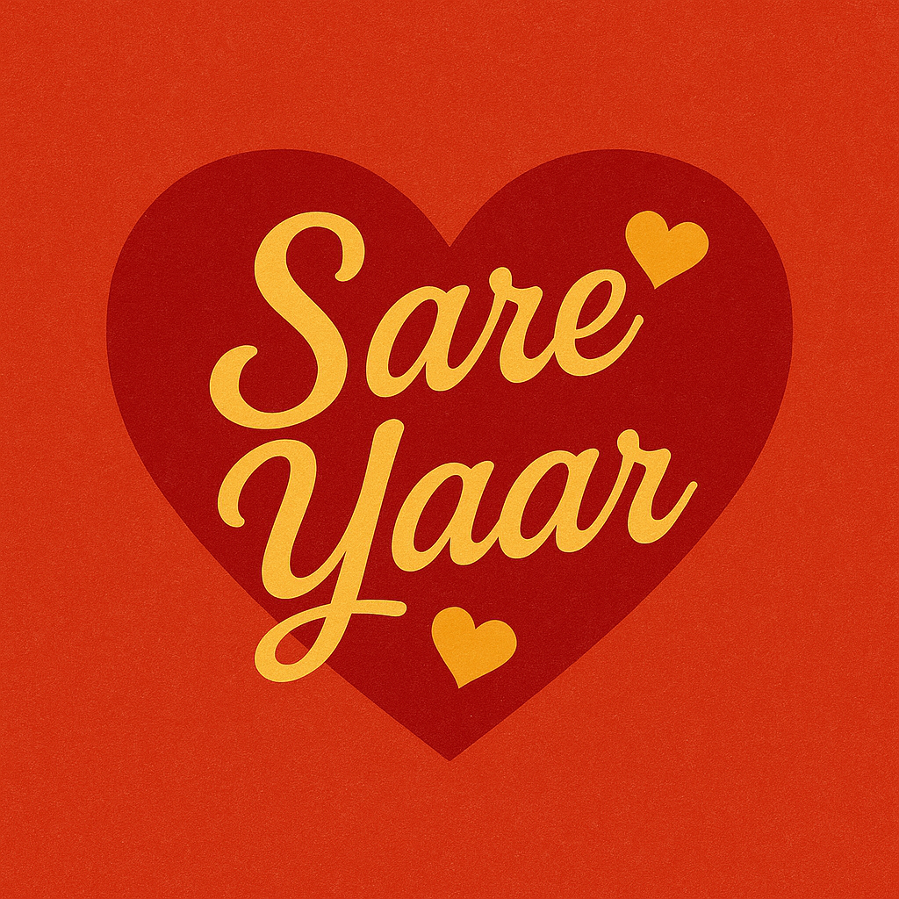
            <h1 class="site-title pulse">SARE YAAR</h1>
            
Class of 2024 - Memories That Last a Lifetime

            
            

                <a href="https://www.instagram.com/codex._.heoster?igsh=MTF1Mzl3MmFnbGxpMg==" class="social-link" aria-label="Instagram"><i class="fab fa-instagram"></i></a>
                <a href="https://www.instagram.com/__pankajthakur7?igsh=bm40Ynppd3h5bjEx" class="social-link" aria-label="Instagram"><i class="fab fa-instagram"></i></a>
               <a href="https://github.com/Heoster" class="social-link" aria-label="Github"><i class="fab fa-github"></i></a>
                <a href="https://chat.whatsapp.com/CNkUA5HS05D9htJ1KLwkrk" class="social-link" aria-label="WhatsApp"><i class="fab fa-whatsapp"></i></a>
            

        

    </header>
    
    <!-- Navigation -->
    <nav>
        

            <a href="https://2024wallepals.simdif.com/images/public/sd_673b6c02b931a.jpg?no_cache=1733914653" class="nav-logo wave">SARE YAAR</a>
            
            <button class="mobile-menu-btn" id="mobileMenuBtn">
                <i class="fas fa-bars"></i>
            </button>
            
            <ul class="nav-links" id="navLinks">
                <li><a href="#home" class="active">Home</a></li>
                <li><a href="#memories">Our Memories</a></li>
                <li><a href="#gallery">Gallery</a></li>
                <li><a href="#poetry">Poetry</a></li>
                <li><a href="#about">About Us</a></li>
                <li><a href="#contact">Contact</a></li>
            </ul>
        

    </nav>
    

        

            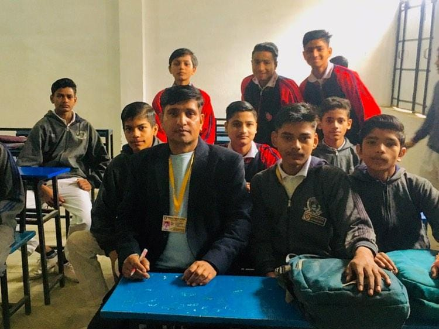
            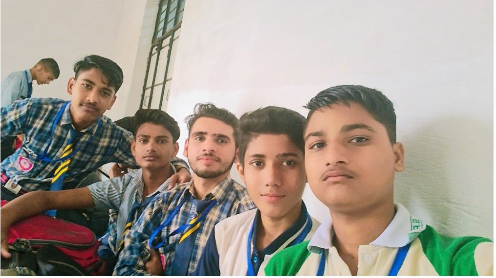
            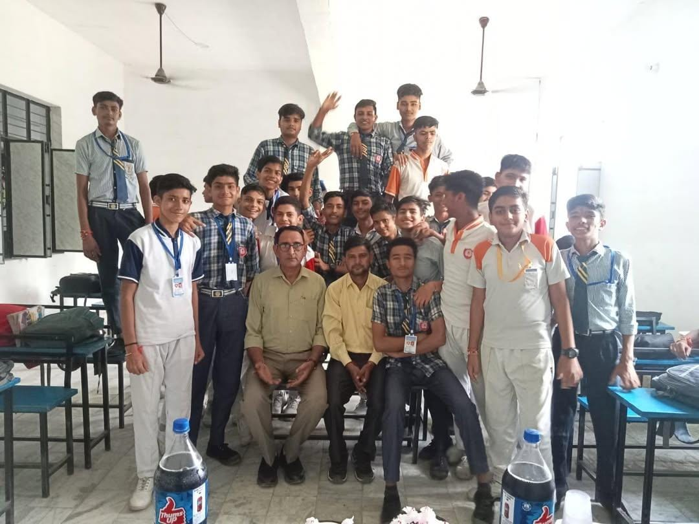
            
            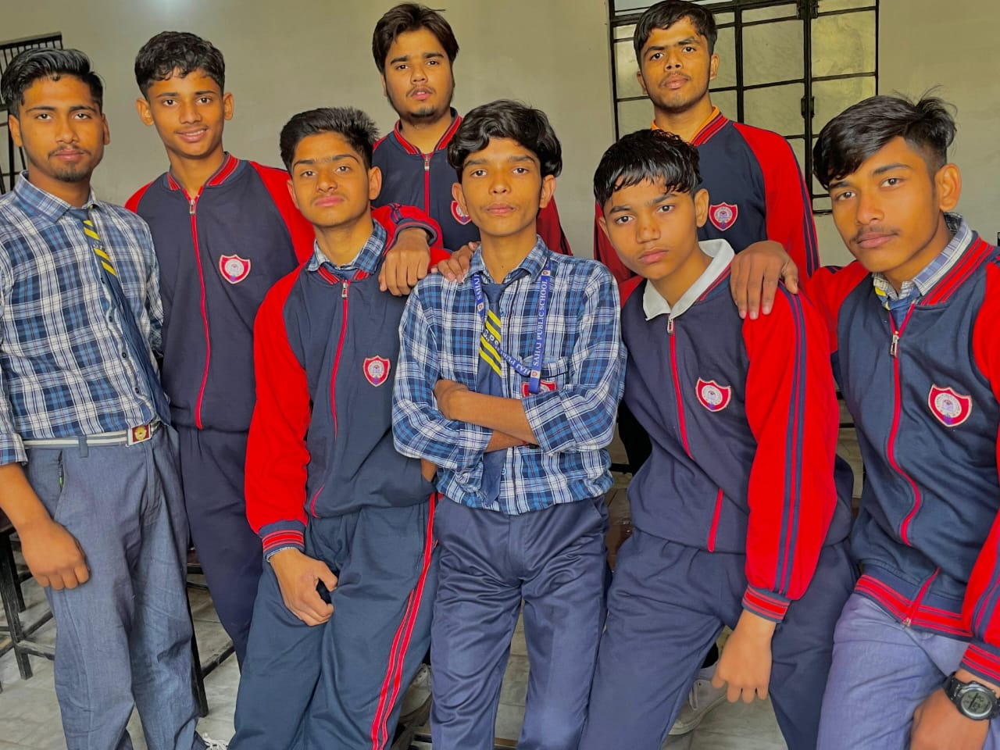
            
            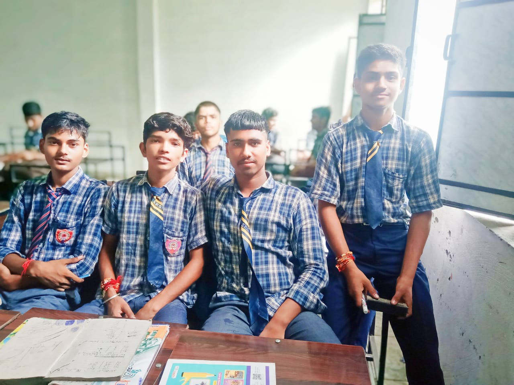
            
            <!-- Duplicate images for seamless looping -->
            
            
            
            
            
            
            
            
        

    

    
    <!-- Main Content -->
    <main class="container">
        <!-- Welcome Section -->
        <section id="home" data-aos="fade-up" data-aos-duration="1000">
            <h2 class="section-title">Welcome to Our Friendship Journey</h2>
            
We were students of class 10 in 2024. Our friendship has no curve till now, but this year we are going to separate. This separation is not easy for us.

            
            

                
"Friendship is the only cement that will ever hold the world together." - Woodrow Wilson

            

            
            
This website is a tribute to our unforgettable moments, inside jokes, and the bond that will last forever.

            
            <a href="#memories" class="btn bounce">Explore Our Memories</a>
        </section>
        
        <!-- Featured Memories -->
        <section id="memories" data-aos="fade-up" data-aos-duration="1000" data-aos-delay="100">
            <h2 class="section-title">Our Special Memories</h2>
            
            

                

                    

                        
First Day - April 2022

                        
The day we all met and our journey began. Little did we know we'd become inseparable.

                    

                

                
                

                    

                        
School Trip - October 2023

                        
That unforgettable trip where we laughed, explored, and created memories to last a lifetime.

                    

                

                
                

                    

                        
Annual Day - December 2023

                        
Our amazing performance that won first prize, thanks to everyone's hard work and teamwork.

                    

                

                
                

                    

                        
Farewell - March 2024

                        
The bittersweet day when we realized our school journey was ending but our friendship wasn't.

                    

                

            

            
            
"We didn't realize we were making memories, we just knew we were having fun."

        </section>
        
        <!-- Photo Gallery -->
        <section id="gallery" data-aos="fade-up" data-aos-duration="1000" data-aos-delay="200">
            <h2 class="section-title">Our Gallery</h2>
            
A collection of our favorite moments together.

            
            

                

                    
                    
School Memory 2023

                

                
                

                    
                    
Annual Day

                

                
                

                    
                    
Classroom Memories

                

                
                

                    
                    
Celebration

                

                
                

                    
                    
Sports Day 2023

                

                
                

                    
                    
What a Day

                

                
                

                    
                    
Special Moment

                

                
                

                    
                    
Group Photo

                

                

                    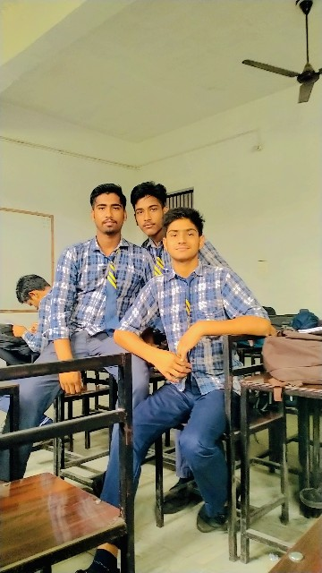
                    
Group Photo

                

            

            
            <a href="https://2024wallepals.simdif.com" class="btn">View Full Gallery</a>
        </section>
        
        <!-- Poetry Section -->
        <section id="poetry" data-aos="fade-up" data-aos-duration="1000" data-aos-delay="300">
            <h2 class="section-title">Our Poetry Corner</h2>
            
            

                

                    

                        
Lost in your mind 
                        I wanna know 
                        Am I losing my mind? 
                        Never let me go

                    

                    

                        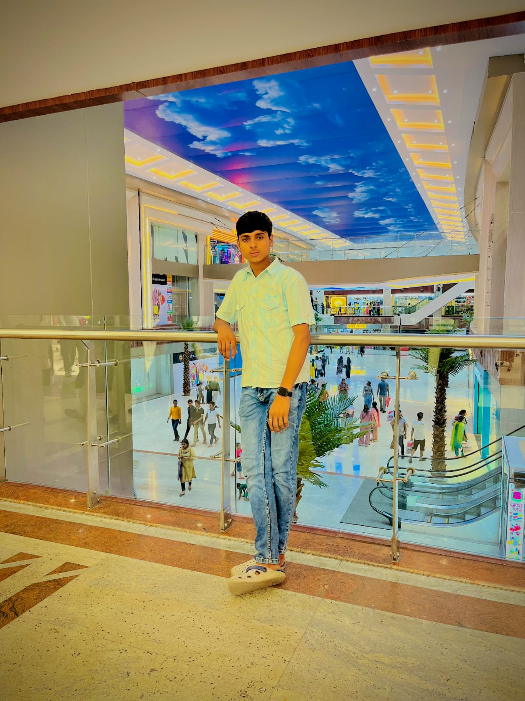
                        

                            <h4>Nawajish</h4>
                            
Poet & Dreamer

                        

                    

                

                

                    

                        
If this night is not forever 
                        At least we are together 
                        I know I'm not alone 
                        I know I'm not alone

                    

                    

                        
                        

                            <h4>HEOSTER</h4>
                            
Who developelop this website.

                        

                    

                

                

                    

                        
If this night is not forever 
                        At least we are together 
                        I know I'm not alone 
                        I know I'm not alone

                    

                    

                        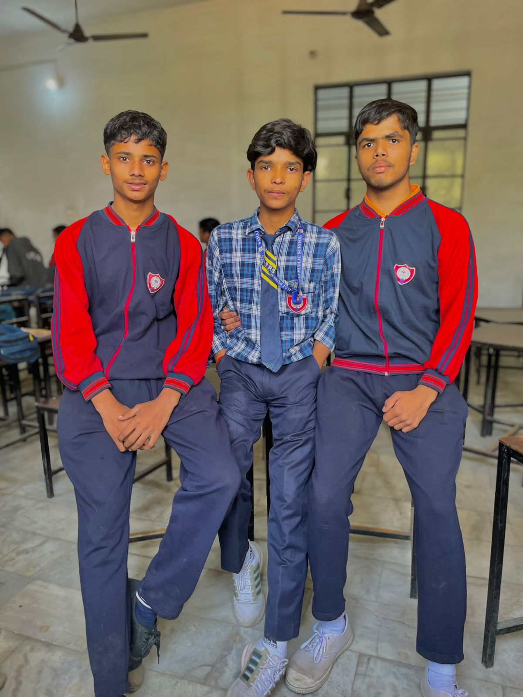
                        

                            <h4>Badmash</h4>
                            
He is the ❤.

                        

                    

                

                
                

                    

                        
If this night is not forever 
                        At least we are together 
                        I know I'm not alone 
                        I know I'm not alone

                    

                    

                        
                        

                            <h4>Pankaj</h4>
                            
Founder of Carpenter Samaj

                        

                    

                

                
                

                    

                        
Nothing can be gained without losing anything, 
                        Even heaven demands death.

                    

                    

                        
                        

                            <h4>Uchiha Vishesh</h4>
                            
Philosopher

                        

                    

                

            

        </section>
        
        <!-- Extended Gallery Section -->
        <section id="extended-gallery" data-aos="fade-up" data-aos-duration="1000" data-aos-delay="400">
            <h2 class="section-title">More Beautiful Memories</h2>
            
Swipe through more moments that made our journey unforgettable.

            

                

                    
                    
Fun Times

                

                

                    
                    
Friendship Bond

                

                

                    
                    
Our Group

                

                

                    
                    
Fun Activities

                

                

                    
                    
Special Moment

                

                

                    
                    
Together Forever

                

                

                    
                    
Fun Day

                

                

                    
                    
Group Photo

                

            

        </section>

        <!-- Masonry Gallery Section -->
        <section id="masonry-gallery" data-aos="fade-up" data-aos-duration="1000">
            <h2 class="section-title">Masonry Memories</h2>
            
A dynamic collage of our special moments in a unique layout.

            
            

                <!-- Column 1 -->
                

                    

                        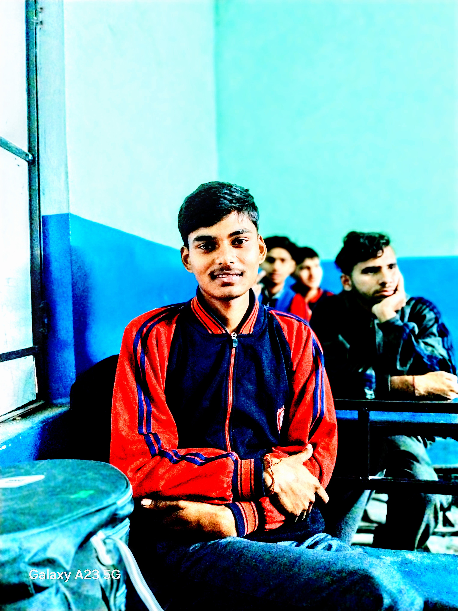
                        
Special Moment H

                    

                    

                        
                        
Special Moment H4

                    

                    

                        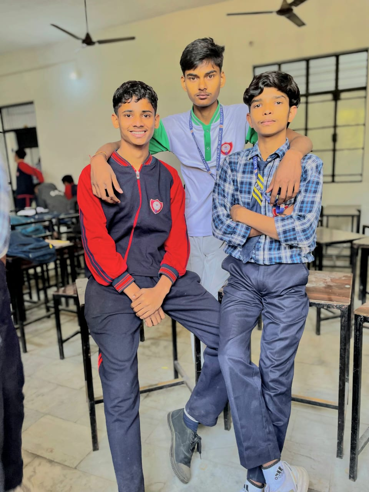
                        
Special Moment H8

                    

                    

                        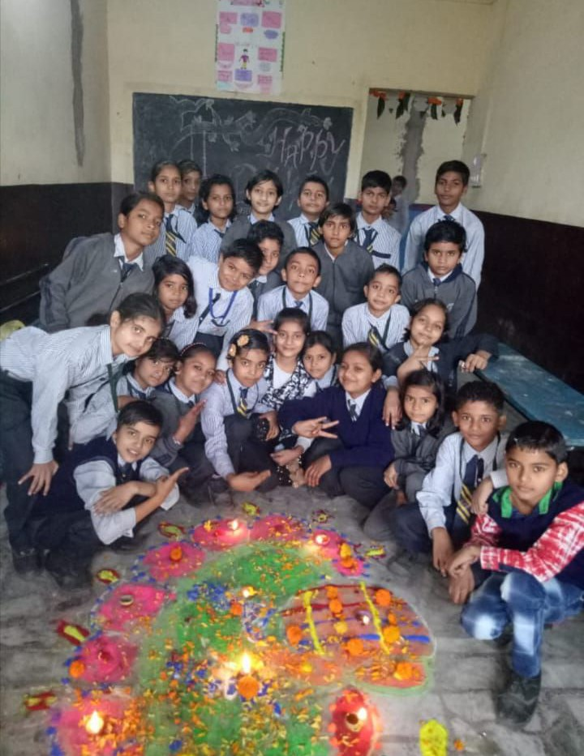
                        
Special Moment H12

                    

                

                
                <!-- Column 2 -->
                

                    

                        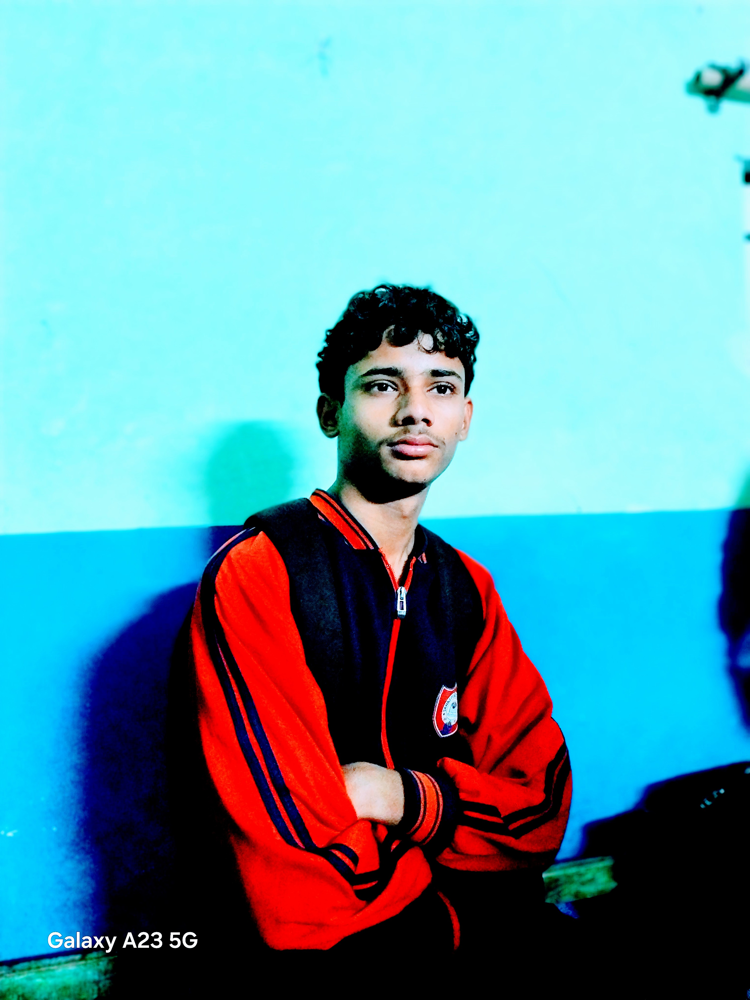
                        
Special Moment H2

                    

                    

                        
                        
Special Moment H5

                    

                    

                        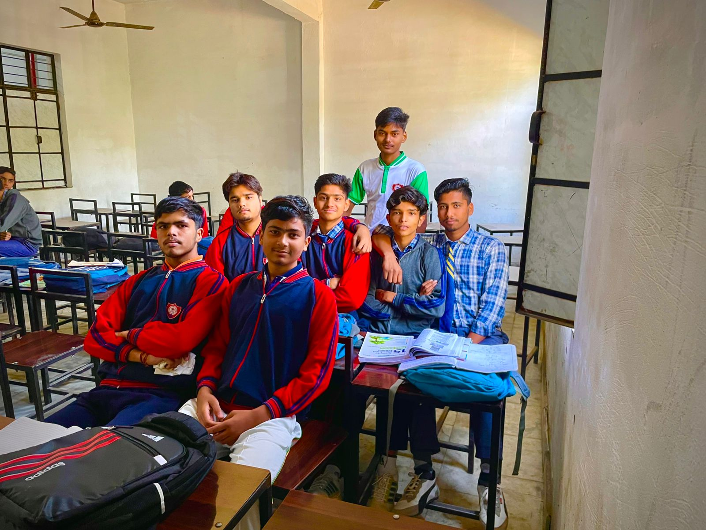
                        
Special Moment H9

                    

                    

                        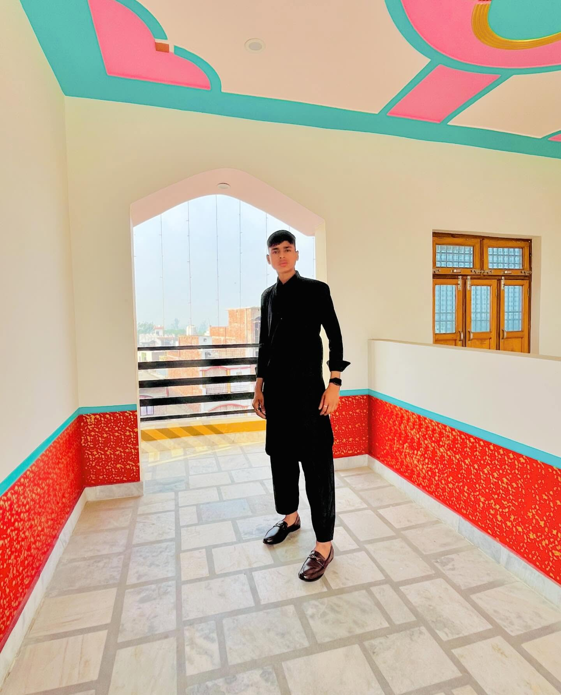
                        
Special Moment H13

                    

                

                
                <!-- Column 3 -->
                

                    

                        
                        
Special Moment H3

                    

                    

                        
                        
Special Moment H6

                    

                    

                        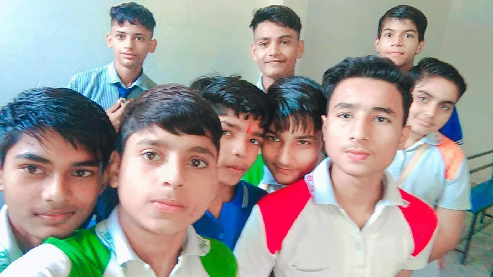
                        
Special Moment H10

                    

                    

                        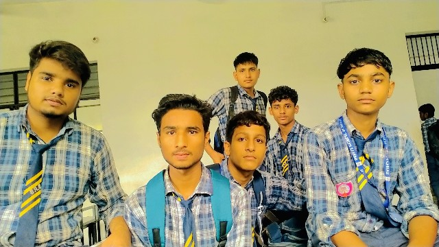
                        
Special Moment H14

                    

                

                
                <!-- Column 4 -->
                

                    

                        
                        
Special Moment H1

                    

                    

                        
                        
Special Moment H7

                    

                    

                        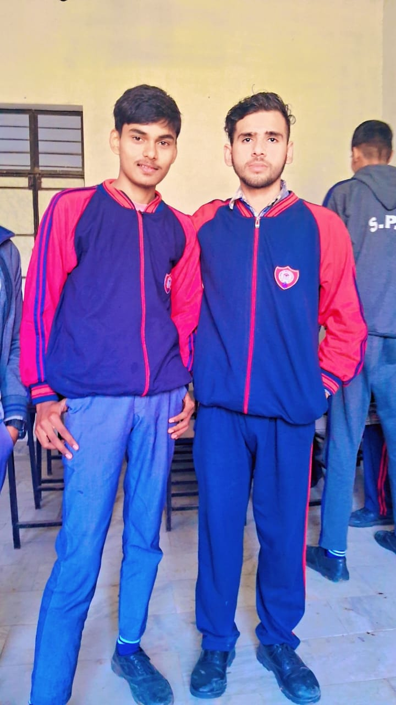
                        
Special Moment H11

                    

                    

                        
                        
Special Moment H15

                    

                

            

        </section>

        <!-- About Section -->
        <section id="about" data-aos="fade-up" data-aos-duration="1000" data-aos-delay="500">
            <h2 class="section-title">About Our Group</h2>
            
            

                
"Our friendship is a history that never repeats again. We are so lucky to have such friends."

            

            
            
We are a group of friends from the class 10th of 2024 who share an unbreakable bond. Despite our different personalities and backgrounds, we've created something truly special together.

            
            

                

                    
                    
Pandat

                

                

                    
                    
HEOSTER

                

                

                    
                    
Pankaj

                

                

                    
                    
Sahil

                

                

                    
                    
Lakshay

                

                

                    
                    
Pasandu

                

                

                    
                    
SARE YAAR💖

                

            
   
        </section>
    
        <!-- Extended Huge Gallery Section -->
        <section id="huge-gallery" data-aos="fade-up" data-aos-duration="1000" data-aos-delay="600">
            <h2 class="section-title">Our Ultimate Memory Gallery</h2>
            
Dive into an extended view of our treasured moments together.

            

                

                    
                    
Special Memory 1

                

                

                    
                    
Special Memory 2

                

                

                    
                    
Special Memory 3

                

                

                    
                    
Special Memory 4

                

                

                    
                    
Special Memory 5

                

                

                    
                    
Special Memory 6

                

                

                    
                    
Special Memory 7

                

                

                    
                    
Special Memory 8

                

                

                    
                    
Special Memory 9

                

                

                    
                    
Special Memory 10

                

                

                    
                    
Special Memory 11

                

                

                    
                    
Special Memory 12

                

                

                    
                    
Special Memory B1

                

                

                    
                    
Special Memory B2

                

                

                    
                    
Special Memory B3

                

                

                    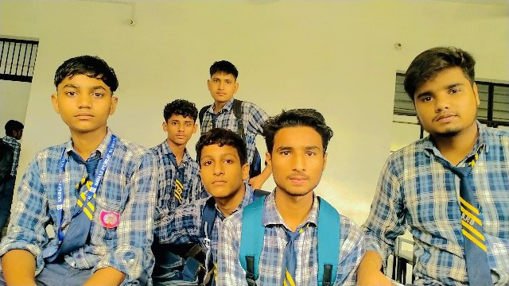
                    
Special Memory B4

                

                

                    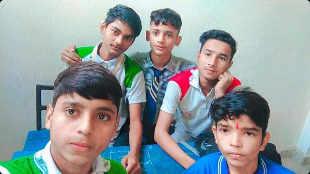
                    
Special Memory B5

                

                

                    
                    
Special Memory B6

                

                

                    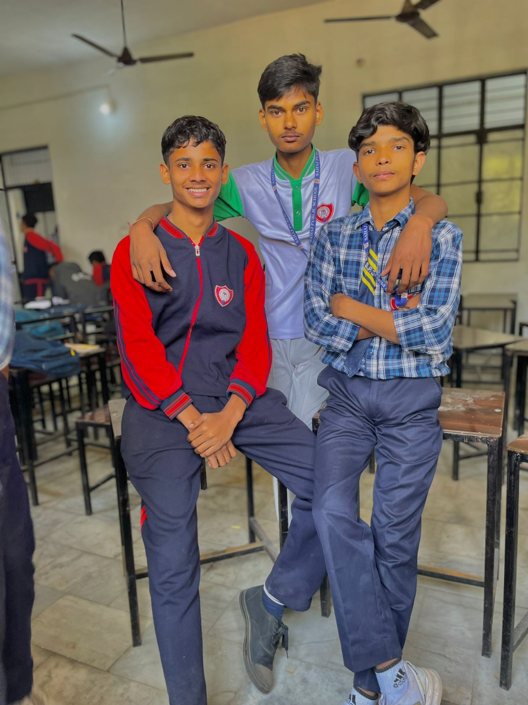
                    
Special Memory B7

                

                

                    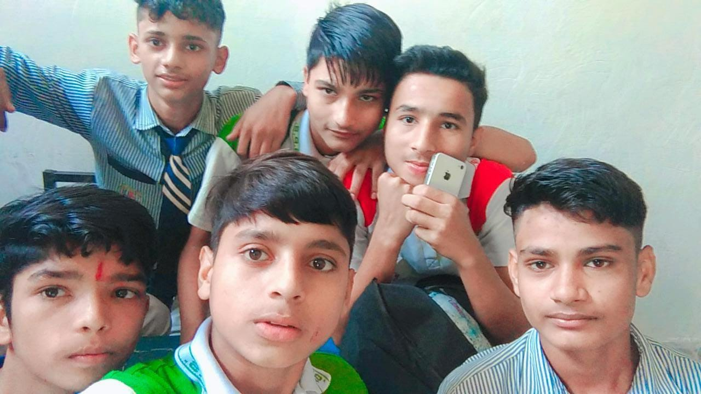
                    
Special Memory B8

                

                

                    
                    
Special Memory B9

                

                

                    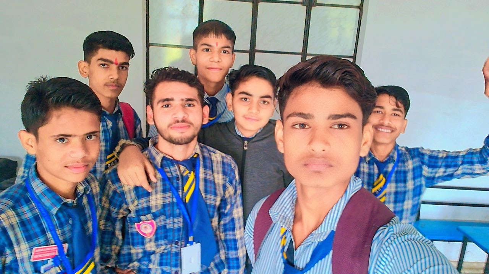
                    
Special Memory B10

                

            

        </section>
    </main>
    
    <!-- Footer -->
    <footer>
        

            <h3 data-aos="fade-up">SARE YAAR - Class of 2024</h3>
            
            

                <a href="https://www.instagram.com/codex._.heoster?igsh=MTF1Mzl3MmFnbGxpMg==" class="social-link" aria-label="Instagram" data-aos="fade-up" data-aos-delay="100"> <i class="fab fa-instagram"></i></a>
                <a href=" #" class="social-link" aria-label="Instagram"" data-aos="fade-up" data-aos-delay="200"><i class="fab fa-instagram"></i></a>
                <a href="https://github.com/Heoster" class="social-link" aria-label="Github" data-aos="fade-up" data-aos-delay="300"><i class="fab fa-github"></i></a>
                <a href="https://chat.whatsapp.com/CNkUA5HS05D9htJ1KLwkrk" class="social-link" aria-label="WhatsApp" data-aos="fade-up" data-aos-delay="400"><i class="fab fa-whatsapp"></i></a>
            

            
            
Copyright Disclaimer: Under section 107 of the Copyright Act 1976, allowance is made for FAIR USE for purposes such as criticism, comment, news reporting, teaching, scholarship and research.

            
            
© 2024 SARE YAAR. All memories preserved.

            
This website is developed by codeex._.heoster.

        

    </footer>
    
    <!-- JavaScript -->
    
    
</body>
</html>
